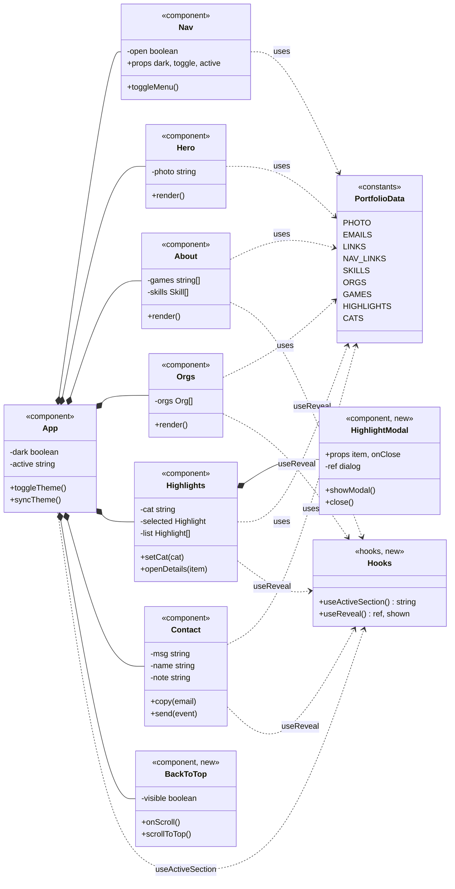

# Class diagram

Class diagram of the portfolio website: the React components, shared hooks, and data constants. Components marked "new" were added in the second activity.

```mermaid
classDiagram
    direction LR

    class App {
        <<component>>
        -dark boolean
        -active string
        +toggleTheme()
        +syncTheme()
    }
    class Nav {
        <<component>>
        -open boolean
        +props dark, toggle, active
        +toggleMenu()
    }
    class Hero {
        <<component>>
        -photo string
        +render()
    }
    class About {
        <<component>>
        -games string[]
        -skills Skill[]
        +render()
    }
    class Orgs {
        <<component>>
        -orgs Org[]
        +render()
    }
    class Highlights {
        <<component>>
        -cat string
        -selected Highlight
        -list Highlight[]
        +setCat(cat)
        +openDetails(item)
    }
    class HighlightModal {
        <<component, new>>
        +props item, onClose
        -ref dialog
        +showModal()
        +close()
    }
    class Contact {
        <<component>>
        -msg string
        -name string
        -note string
        +copy(email)
        +send(event)
    }
    class BackToTop {
        <<component, new>>
        -visible boolean
        +onScroll()
        +scrollToTop()
    }
    class Hooks {
        <<hooks, new>>
        +useActiveSection() string
        +useReveal() ref, shown
    }
    class PortfolioData {
        <<constants>>
        PHOTO
        EMAILS
        LINKS
        NAV_LINKS
        SKILLS
        ORGS
        GAMES
        HIGHLIGHTS
        CATS
    }

    App *-- Nav
    App *-- Hero
    App *-- About
    App *-- Orgs
    App *-- Highlights
    App *-- Contact
    App *-- BackToTop
    Highlights *-- HighlightModal

    Nav ..> PortfolioData : uses
    Hero ..> PortfolioData : uses
    About ..> PortfolioData : uses
    Orgs ..> PortfolioData : uses
    Highlights ..> PortfolioData : uses
    Contact ..> PortfolioData : uses

    App ..> Hooks : useActiveSection
    About ..> Hooks : useReveal
    Orgs ..> Hooks : useReveal
    Highlights ..> Hooks : useReveal
    Contact ..> Hooks : useReveal
```
